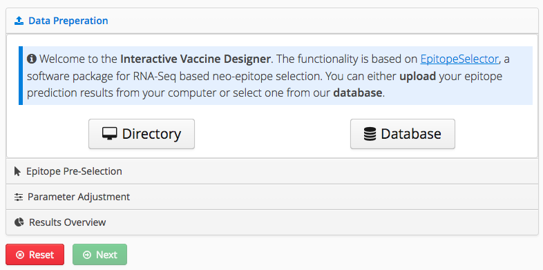
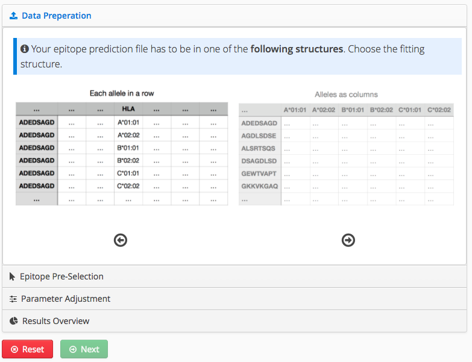
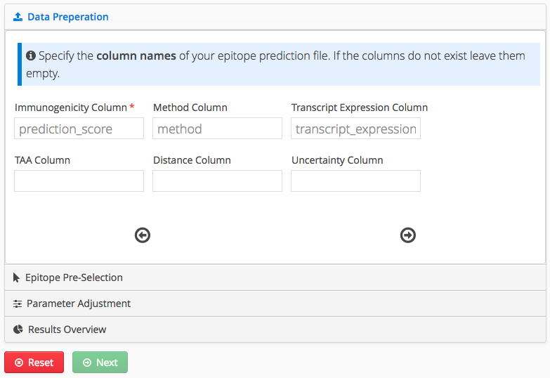
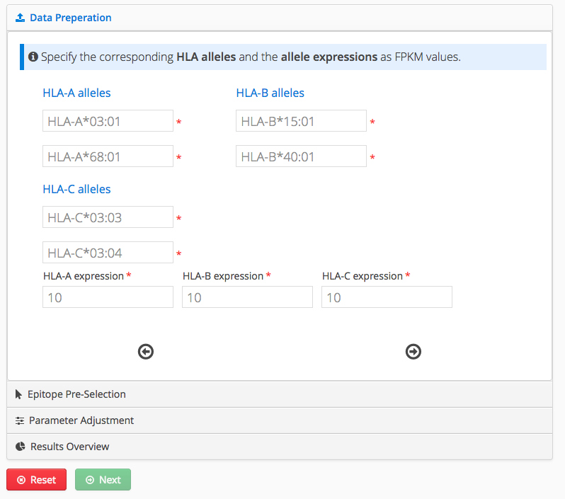
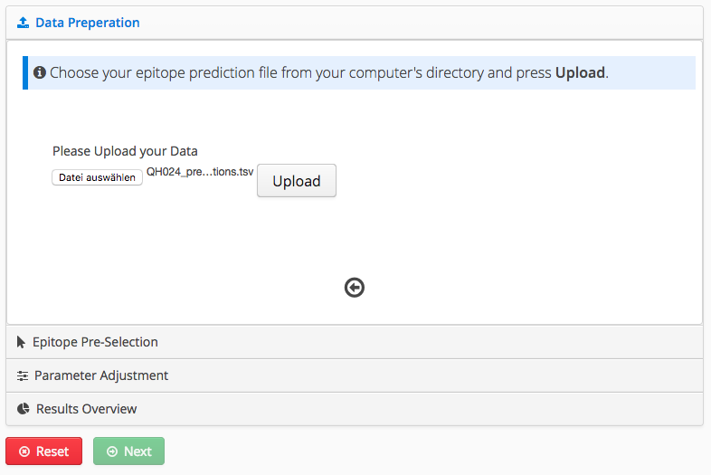
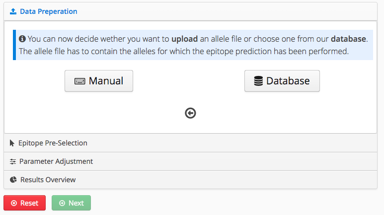
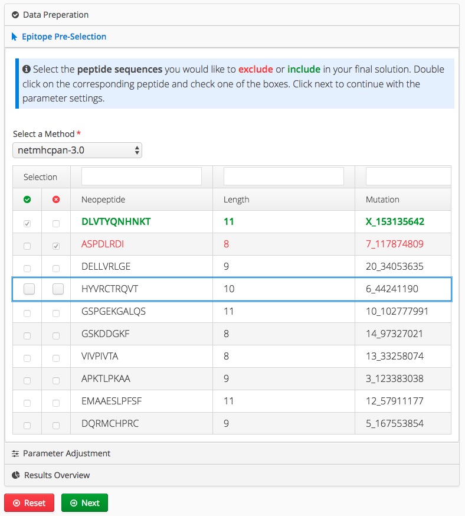
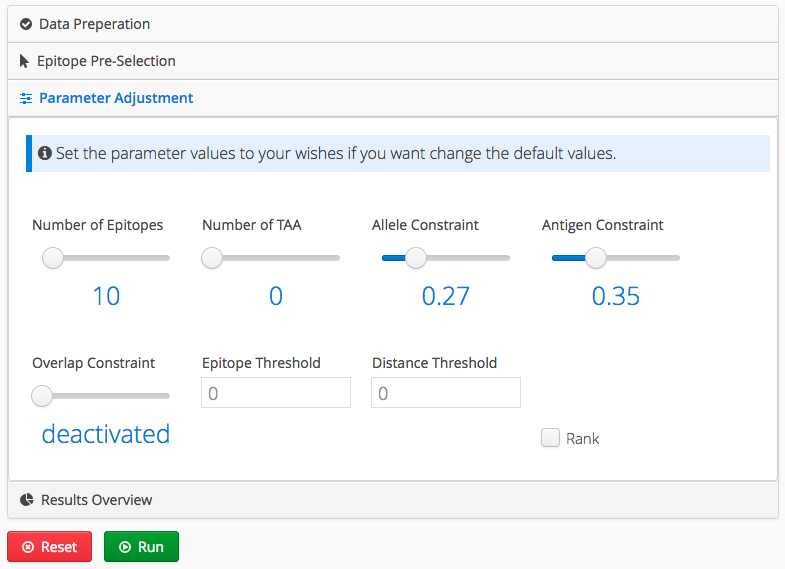
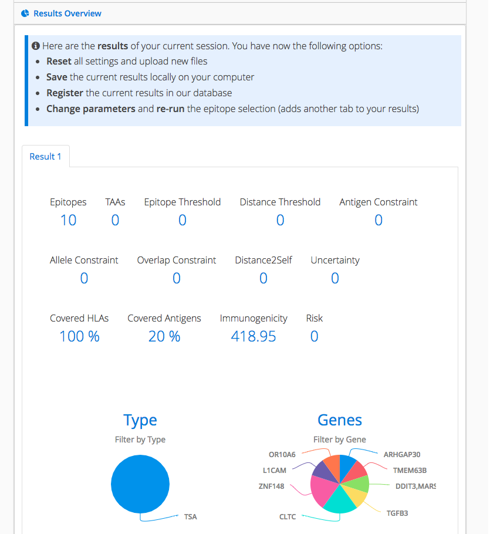
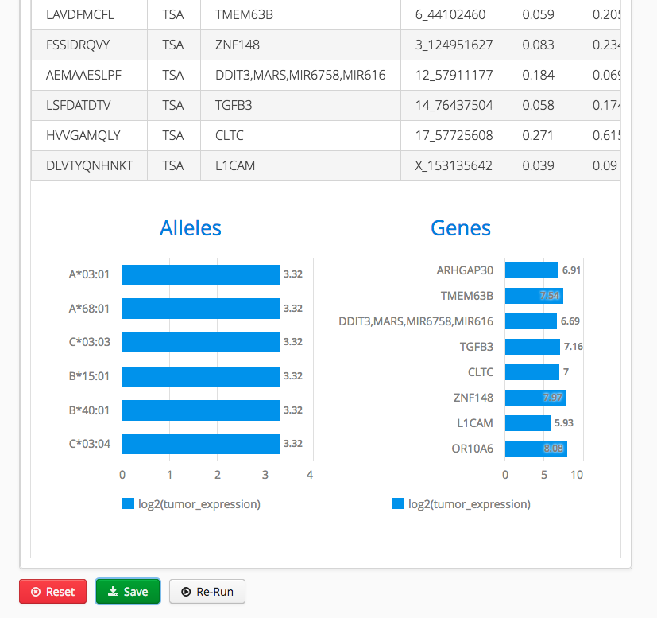

# Interactive Vaccine Designer 

A portlet for the interactive design of individualized vaccines. 

## Getting Started

The Interactive Vaccine Designer is avaiable as a portlet of [QPortal](https://portal.qbic.uni-tuebingen.de/portal/).

## How-to

### Data preperation

**Upload file**

1. Press the *Directory*-Button
2. Select the structure of your input data
	* Each allele in a row or the alleles as individual columns
3. Enter the column names as they are named in your input file.
	* Immunogenicity is always required
	* Method is required if the input includes data from several methods
	* TAA column is needed if the type of antigen is given (TAA/TSA), otherwise all input is handled as TSA 	
4. Specify the alleles and allele expressions
	* Make sure the alleles fit to your input file, this is not done automatically yet. 
5. Choose a file from your directory and press the *Upload*-Button

**Choose file from database**

1. Press the *Database*-Button
2. Select if you want to choose an allele file from the database or manually enter the allele information (in this example the allele file is chosen from the database, too)
3. Select the structure of your input data
	* Each allele in a row or the alleles as individual columns
3. Enter the column names as they are named in your input file.
	* Immunogenicity is always required
	* Method is required if the input includes data from several methods
	* TAA column is needed if the type of antigen is given (TAA/TSA), otherwise all input is handled as TSA 	
4. Specify allele expressions
5. Choose a project from your space and the epitope prediction file of your choice. Also choose an allele file.
	* Make sure the allele-file fits to your input file, this is not done automatically yet. 

### Epitope Pre-Selection

1. Select a method to view its peptides and corresponding information in the table.
2. Peptides you want to have in your final set can be marked as included.
3. Peptides you do not want to have in your final set can be marked as excluded, so they are ignored during the computation
4. Click on the *Next*-Button to continue.

### Parameter Adjustment

1. Set the parameter values as needed, but be aware that for some parameter combinations the interavtive vaccine designer cannot compute a solution. Choose the parameters wisely.
2. Press the *Run*-Button to start the computation. Is the computation takes to much time it can be easily canceled by pressing the *Cancel*-Button. If the computation is not successfull a corresponding notification shows up and you should try to check if your parameters do make sense or if you falsely described your epitope prediction or allele file.

### Results Overview

1. After a successful computation you are directly forwarded to the *Results Overview*. Here you can see each result of your current session in a tab. The computet epitopes can be filtered through by clicking the pie charts.
2. The *Reset*-Button let you start from the beginning and allows you to upload a new file
3. The *Re-run*-Button allows you run a new computation with different parameters. Just click on the Parameter Adjustment or Epitope-Preselection tab and make some changes and finally press the *Re-run*-Button
4. The *Save*-Button downloads all of the computed results in a Text-File to save it on a directory on your Computer.
5. Did you choose the database file upload there is an additional Button called *Register*. That button registers your current results to the corresponding project in the database.

## Built With

* [Vaadin](https://vaadin.com/) - Java Web Framework
* [Maven](https://maven.apache.org/) - Dependency Management
* [EpitopeSelector](https://hub.docker.com/r/aperim/epitopeselector/) - Software package for RNA-Seq based neo-epitope selection

## Authors

* **Julian Späth** - *Initial work* - [Quantitative Biology Center Tübingen](https://www.uni-tuebingen.de/einrichtungen/zentrale-einrichtungen/zentrum-fuer-quantitative-biologie-qbic.html)

## Problems
If you recognize any bugs or other problems please send an e-mail with the description of your problem directly to [Julian Späth](mailto:spaethju@posteo.de).